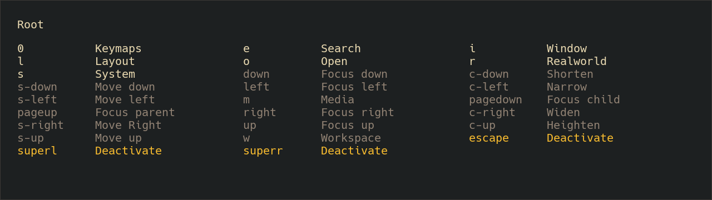

# Longcut

Key-sequence based command executor for Linux on X11.

## Index

- [Introduction](#introduction)
- [Installation](#installation)
- [Configuration](#configuration)
- [Contributing](#contributing)
- [Developing](#developing)
- [License](#license)

## Introduction

Longcut is a key-sequence based command executor, which attempts to resolve the
usability conflict of having an ever-growing number of useful tools and commands
bound to the push of a button, but having an ever-decreasing number of free
buttons to bind those tools and commands to. The way Longcut does this is by
allowing you to bind commands to _semantically meaningful sequences of keypresses_.

As an example, in Windows the common _shortcut_ for capturing a screenshot of a
selectable region is `Win + Shift + S`. To pull that off, you need to push down
_three_ buttons at once and, worst of all, remember the whole key combination.

Now imagine instead that you could convert that intention into a sequence of steps,
after which the desired action would happen. This is exactly what Longcut allows you to
do.

The original intention:

```txt
I want to
take a Screenshot
of a Region
=>
(Screenshot is now available in the system clipboard)
```

Can, with the help of [scrot](https://github.com/resurrecting-open-source-projects/scrot),
be represented as a sequence:

```txt
Win (Start new sequence)
S (Screenshot)
R (Region)
=>
scrot --select - | xclip -selection c -t image/png
```

Which in configuration looks like:

```yaml
core:
  layers:
    - name: Screenshot
      shortcut: s
      commands:
        - name: Region
          shortcut: r
          steps:
            - bash: scrot --select - | xclip -selection c -t image/png
          synchronous: false
```

Which is easily extended for capturing the whole screen or the active window:

```yaml
core:
  layers:
    - name: Screenshot
      shortcut: s
      commands:
        - name: Region
          shortcut: r
          steps:
            - bash: scrot --select - | xclip -selection c -t image/png
          synchronous: false
        - name: Screen
          shortcut: s
          steps:
            - bash: scrot - | xclip -selection c -t image/png
        - name: Window
          shortcut: w
          steps:
            - bash: scrot --focused - | xclip -selection c -t image/png
```

And so, instead of having to remember ever stranger combinations of modifier
keys, you can _one key at a time_ traverse a sequence that is easy to remember
because it represents what you want to do. And if you can't remember (I often
forget!), the pop-up UI panel is always there to show you:


(Contents shown in the screenshot are based on the [example configuration](examples/longcut.yaml).)

Now you know why Longcut exists and most of how it is used. If you'd like to give
it a try, proceed to the next section for installation instructions.

## Installation

Longcut supports the following installation methods:

- [Nix flake install (experimental)](#nix-flake-install) (NixOS, Nix package manager)
- [Compile from source](#compile-from-source) (Ubuntu, Fedora)

### Nix flake install

To install Longcut as a [Nix](https://nixos.org/) flake, you must either be running
the NixOS operating system or have the Nix package manager installed. The `flake.nix`
file can be found under the [repository root](/flake.nix) and can be referred to with
the name `github:satajo/longcut`.

With NixOS, simply add the above flake reference to your configuration.

With Nix package manager, install the flake with the following command:

```sh
nix profile install github:satajo/longcut
```

### Compile from source

Components of Longcut depend on the following system packages. Make sure that
they are installed before proceeding.

Fedora:

- cairo-devel
- libxcb-devel
- libxkbcommon-devel

Ubuntu:

- libcairo2-dev
- libxcb-dev
- libxkbcommon-dev

Clone the repository and run the following command in the repository root to
build and install Longcut.

```sh
cargo install --path longcut-application/
```

After installation, the Longcut binary is available under your cargo-bin-path
under the name `longcut`. Try running `longcut --help` to see if the binary
installed correctly.

Now that you have installed Longcut, you should read the next section about how
to configure it to do what you want.

## Running

Longcut runs as a resident process that owns its launch keys. Start it
once from your session, for example from your i3 configuration:

```txt
exec --no-startup-id longcut
```

or as a systemd user service, which also restarts it should it crash:

```ini
[Unit]
Description=Longcut
PartOf=graphical-session.target
After=graphical-session.target

[Service]
ExecStart=%h/.cargo/bin/longcut
Restart=on-failure
RestartSec=2

[Install]
WantedBy=graphical-session.target
```

The launch keys are configured under `x11: launcher:` as `keys_launch_global`
for the global layers and `keys_launch_app` for the layers of the focused
application. Longcut binds them on the X server itself, so the window manager
must not bind them as well. From the moment a launch key is pressed every
key goes to Longcut, including keys typed before the panel is on screen, and
the keys held to press the launch key do not count as modifiers of the
keys that follow: with `Super_L` as the launch key, `Super+f` typed as one
quick chord is `f`. Changes to the configuration take effect when the process
is restarted.

Only one instance runs at a time; a second one exits at once.

The keyboard stays captured until the session ends, including while a command
runs. A command that expects keyboard input of its own, such as an interactive
selection tool, should be configured with `synchronous: false` so the session
ends as soon as it has started the command.

If startup fails, for example because a launch key cannot be bound or
the configuration is invalid, the error is shown on screen for a few seconds.
`longcut check-config` reports the same configuration errors in the terminal.

## Configuration

(It's probably a good idea to open the [example configuration](examples/longcut.yaml)
in another tab when reading this section.)

Longcut is configured through a `yaml` configuration file. The default path for
this file is in the user's home config directory, in `~/.config/longcut/longcut.yaml`.
The configuration is parsed on startup, and any error in configuration file results
in an immediate startup error.

The Longcut codebase is structured into modules, which are responsible for reading
and parsing their own configurations. This is reflected in the configuration file
structure, as the top-level keys (`core:`, `gui:`, `shell:`, etc.) correspond to
these modules. The module-specific configuration sits under the module's key.

Each module's configuration is documented separately, and are listed below:

- [core](longcut-core/README.md) - Core logic: layer and command definitions, keybinds, etc.
- [gui](longcut-gui/README.md) - User interface: look and feel, fonts, colours, size, position, etc.
- [shell](longcut-shell/README.md) - Shell command execution: default_timeout.
- [x11](longcut-x11/README.md) - Launcher keys.

And with that, that is all of the configuration. If you feel like there is
something missing, you may be interested in reading the next section about
how to contribute to Longcut.

## Contributing

First of all, a disclaimer. Longcut was born out of my personal wanting to have
a tool like it. As such, Longcut has a long history of being Done until it
suddenly isn't, and then being Done again. That has been the cycle of
development all this time, and there is a good possibility that at the time
which you are reading this, Longcut is currently Done.

There are two exceptions to the above. First of all, bugs and any obviously wrong
behaviour ought to be corrected. As Longcut is such an _important_ interface to
me on the human-computer pathway, there is no reason to have it behave incorrectly.
Detailed and actionable bug reports are always welcome, as are their fixes.

Second, there exists the possibility that Longcut is not currently Done for _you_.
If that is the case, I do invite you to open an issue as a feature request or to
go develop and experiment in search of improvements! If that search leads you
to a Done of your own, then I don't see a reason to not also make a pull request
about it.

That said, if you're going to contribute, you should also read the following
section to understand how and why that is done.

## Developing

This project uses standard Rust ecosystem tooling, provided by Nix and orchestrated
through the Makefile. The project is built using `make build`, tested using `make check`
and the code can be formatted using `make format`.

All dependency versions and crate metadata is centrally managed in the workspace
root, and crates should always refer to those instead of declaring their own
versions.

Longcut is structured around a [ports-and-adapters architecture](<https://en.wikipedia.org/wiki/Hexagonal_architecture_(software)>),
which is also reflected on the crate level. Each crate may export different port
definitions, represented by Rust traits, which are then implemented in special
adapter crates that bridge the domains of the port-declaring and the adapter-implementing
crates. By convention, these adapter crates reside under the directory of the
implementing side.

Extending the above, Longcut _heavily_ utilises crates as boundaries to divide code
into minimally sized chunks based on somewhat fuzzy domain boundaries. The logic
behind the division can be summed up by "If some concept feels wholly independent,
and it could be made independent, then it should be made independent."

The entry point and the best place to start drilling downwards is the `longcut-application`
crate, which contains the main function. From there you can see how modules are
wired together, and begin to build an understanding.

## License

Copyright (c) Sami Jokela.

Longcut is licensed under the [GNU General Public License v3.0](COPYING) or later.
